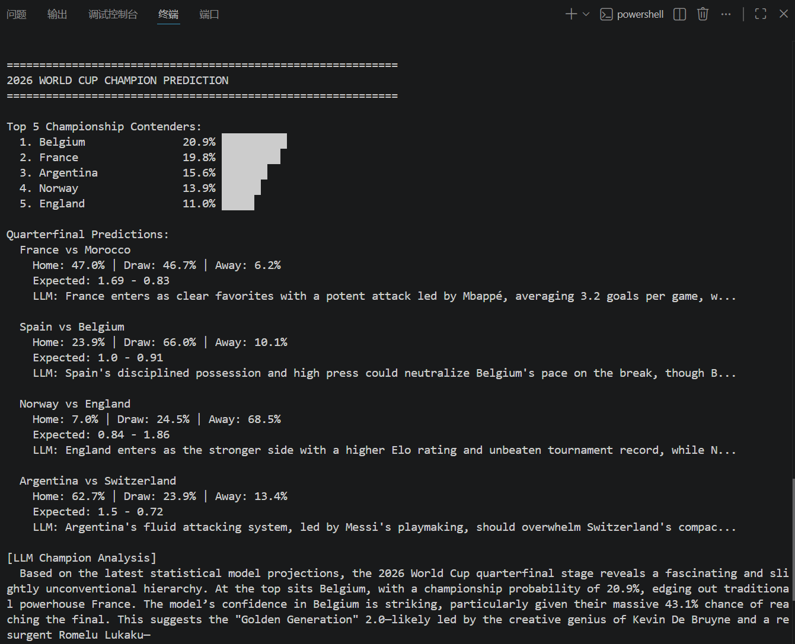
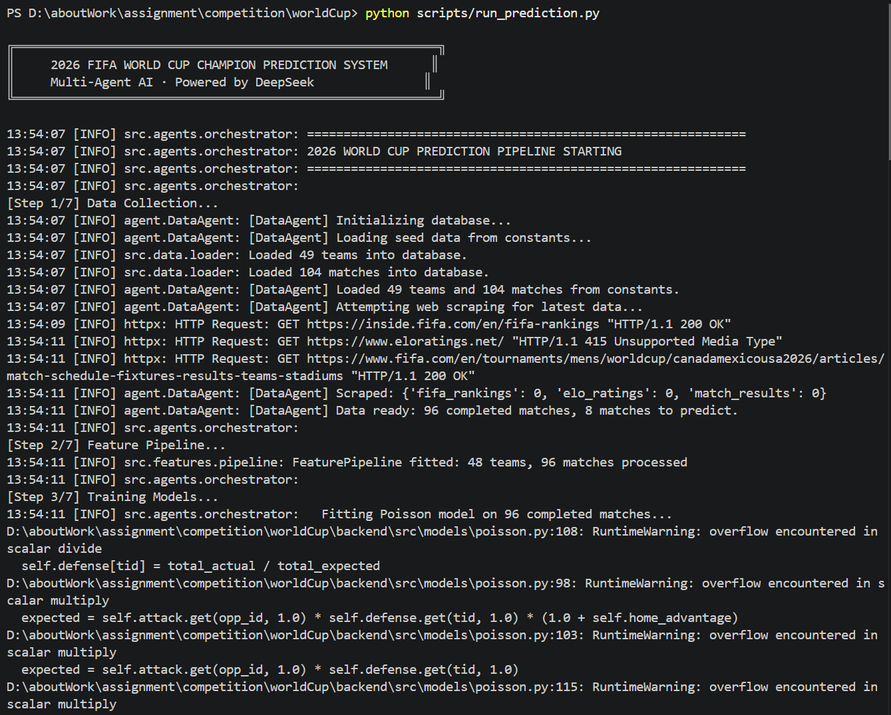
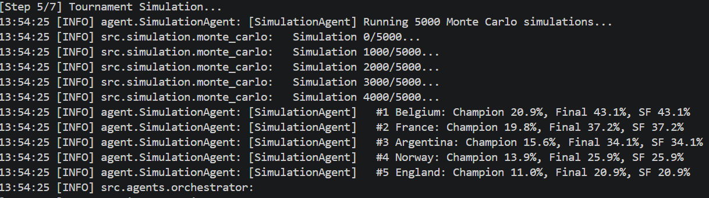
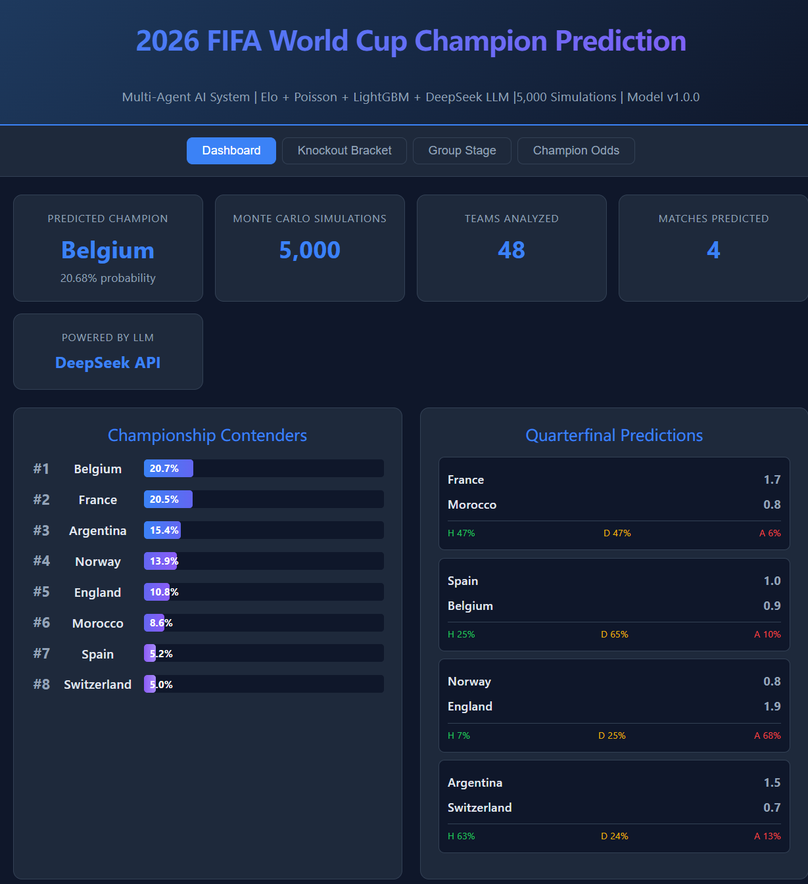
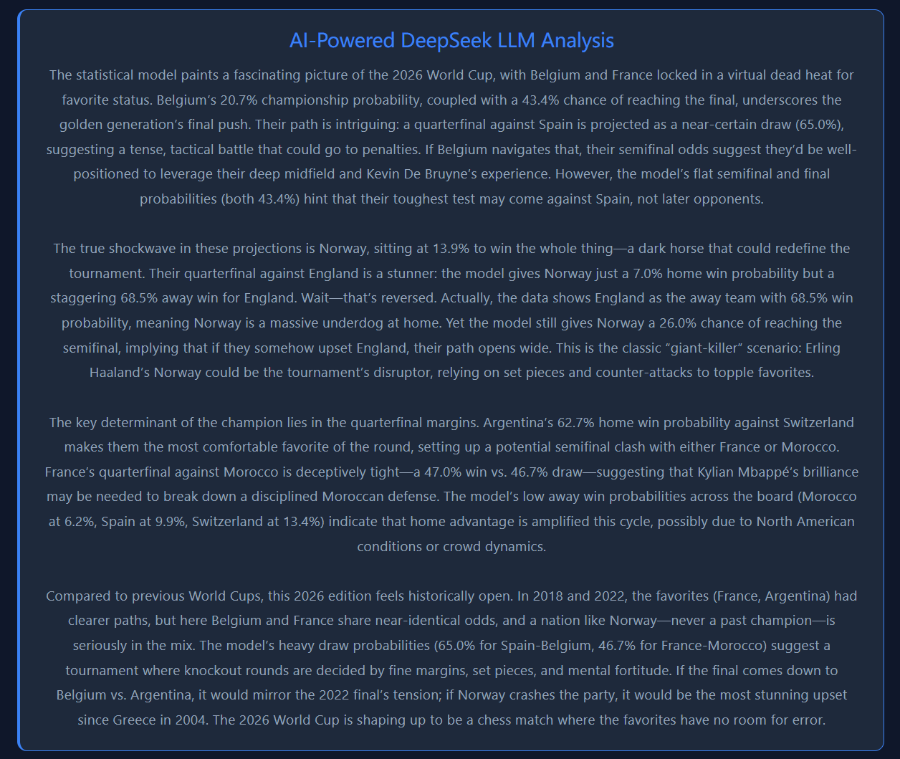
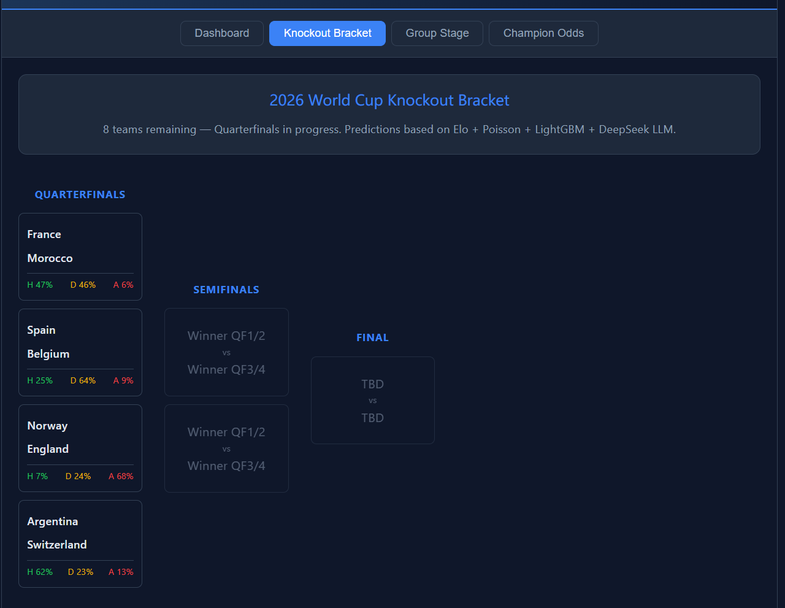
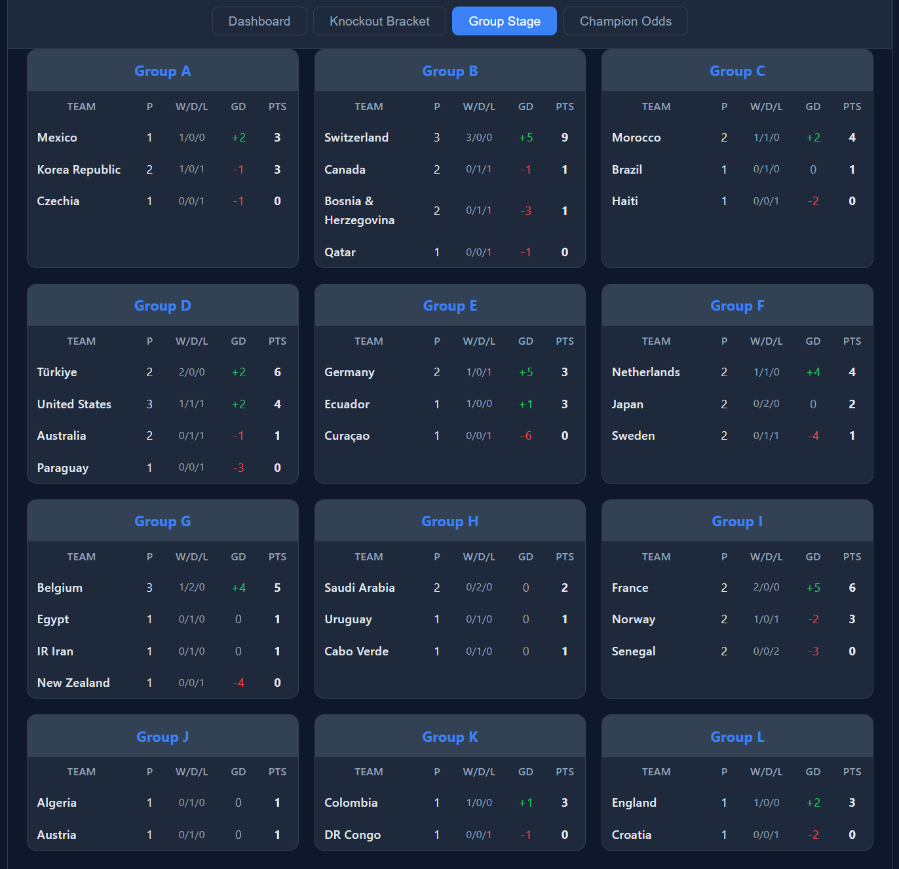
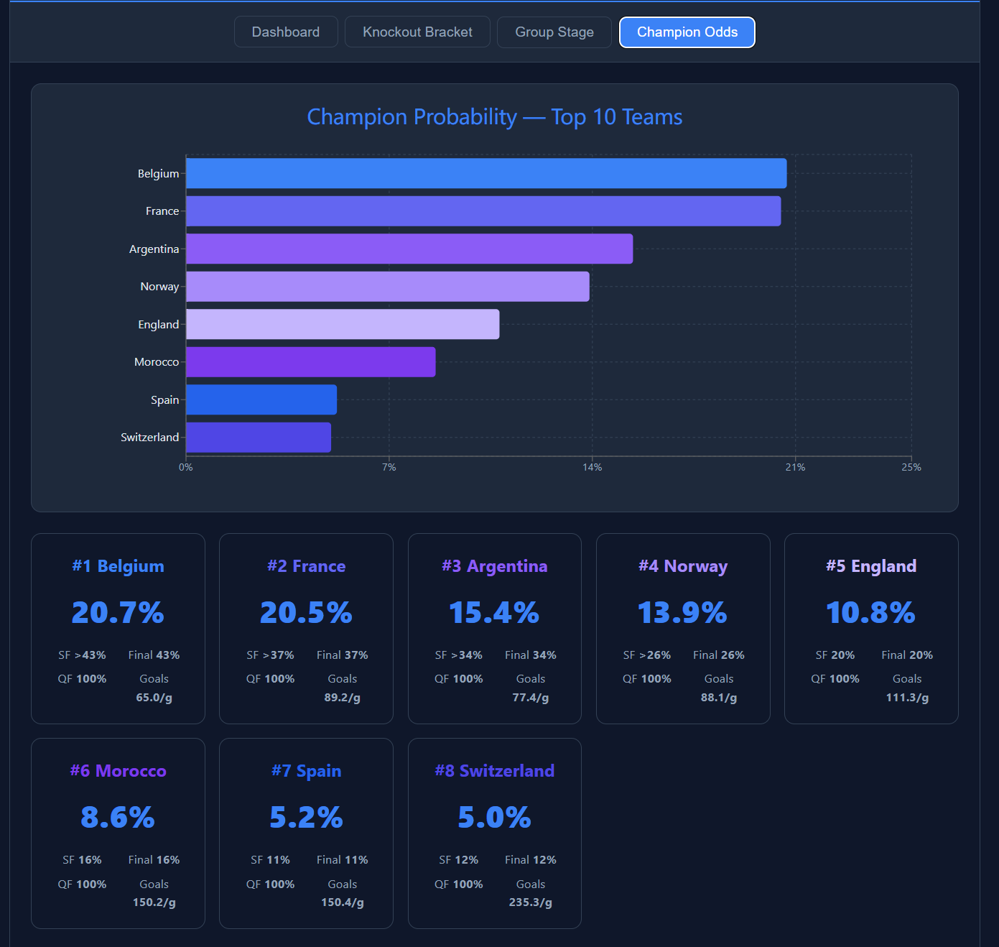
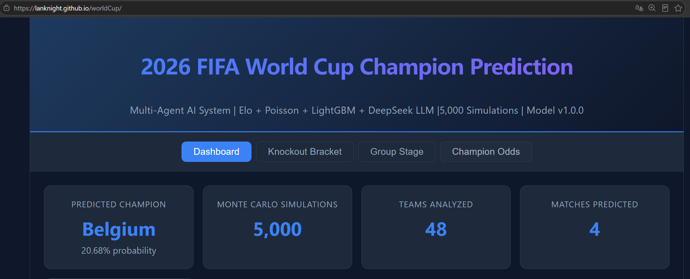

# Qoder码力星期四·世界杯挑战赛 —— 2026世界杯AI多智能体冠军预测系统

> **一句话总结**：构建了一个融合 Elo评分、泊松分布、LightGBM机器学习 和 **Qoder** 的四引擎AI预测系统，通过5个协作Agent + 5000次蒙特卡洛模拟，预测2026年世界杯冠军。

---

## 一、项目背景

2026年FIFA世界杯正在北美如火如荼地进行中。48支球队、12个小组、104场比赛——这是有史以来规模最大的一届世界杯。截至2026年7月9日，小组赛（72场）、32强（16场）和16强（8场）淘汰赛已经结束，8支球队进入1/4决赛：

| 球队 | FIFA排名 | 世界杯冠军次数 |
|------|:------:|:------------:|
| 🇫🇷 法国 | #1 | 2次 |
| 🇦🇷 阿根廷 | #2 | 3次（卫冕冠军） |
| 🇪🇸 西班牙 | #3 | 1次 |
| 🏴󠁧󠁢󠁥󠁮󠁧󠁿 英格兰 | #4 | 1次 |
| 🇲🇦 摩洛哥 | #6 | 0次 |
| 🇧🇪 比利时 | #8 | 0次 |
| 🇨🇭 瑞士 | #14 | 0次 |
| 🇳🇴 挪威 | #19 | 0次 |

> ⚡ **本届亮点**：传统强队德国、巴西已爆冷出局！挪威（哈兰德领衔）首次闯入世界杯八强！

---

## 二、系统架构


### 技术栈

| 层 | 技术选型 | 理由 |
|---|---------|------|
| 数据存储 | SQLite | 零配置单文件，数据量适中 |
| 统计模型 | Elo + 双变量泊松 | 经典体育预测方法 |
| 机器学习 | LightGBM | 小样本表格数据最佳选择 |
| 大模型 | DeepSeek API | 战术分析、风格克制判断、叙事生成 |
| 多Agent | 纯Python类编排 | 5个Agent通过context dict协作 |
| 前端 | React 18 + TypeScript + Vite | 组件化、类型安全 |
| 图表 | Recharts | React原生，暗色主题适配 |
| 部署 | GitHub Pages | 免费静态托管 |

---

## 三、数据采集与处理

### 3.1 数据来源

- **FIFA官方排名**：赛前48队的世界排名
- **Elo评分**：来自 eloratings.net，比FIFA排名更能反映真实实力
- **2026实际赛果**：小组赛72场 + R32 16场 + R16 8场 = 96场已赛比赛
- **历史训练数据**：2014/2018/2022三届世界杯完整数据（~192场）
- **兜底数据**：所有核心数据硬编码于 `constants.py`，确保爬虫失效时系统仍可运行

### 3.2 数据存储

使用SQLite数据库，4张核心表：

```sql
teams       -- 球队信息（FIFA排名、Elo评分、所属洲际）
matches     -- 104场比赛（赛程、比分、状态）
predictions -- 预测结果（各模型概率、LLM修正因子）
tournament_predictions -- 锦标赛级预测（夺冠概率、各轮晋级概率）
```

### 3.3 特征工程

从原始数据提取约 **25维特征**：

| 类别 | 特征示例 |
|------|---------|
| 球队实力 | Elo评分、Elo差值 |
| 进攻效率 | 场均进球、射门数 |
| 防守能力 | 场均失球、零封率 |
| 近期状态 | 近5场积分、连胜 |
| 赛事情境 | 阶段系数、主场优势 |
| 疲劳度 | 距上场比赛天数 |

---

## 四、⭐ 混合预测引擎（核心创新）

这是我们系统的核心——**四引擎加权融合**：

### 4.1 Elo评分模型（权重20%）

使用 **K=40** 的世界杯权重因子，每场真实比赛后动态更新。胜率公式：

```
P(A胜) = 1 / (1 + 10^((Elo_B - Elo_A) / 400))
```

### 4.2 双变量泊松模型（权重20%）

极大似然估计（MLE）拟合各队的进攻强度λ和防守强度μ，计算每场可能比分的联合概率：

```
P(i:j) = Poisson(i; λ_home) × Poisson(j; λ_away)
```

### 4.3 LightGBM梯度提升树（权重45%）

在2014-2022三届世界杯 + 2026年96场数据上训练。防止小样本过拟合的强正则化：

```python
LGB_PARAMS = {
    "max_depth": 4, "num_leaves": 16,
    "min_data_in_leaf": 10, "reg_alpha": 0.1, "reg_lambda": 0.1,
}
```

### 4.4 ⭐ Qoder分析（权重15%）— 本次最大创新点

> **核心设计原则：LLM不直接预测赛果，而是输出结构化战术修正因子（±5%以内）**

**为什么这样做？**
- 避免大模型"幻觉"问题
- 保持预测的可控性和可解释性
- 将LLM定位为"战术分析师"而非"预言家"

**DeepSeek API调用代码**：

```python
from openai import OpenAI

client = OpenAI(
    api_key="your-deepseek-api-key",
    base_url="https://api.deepseek.com/v1"
)

response = client.chat.completions.create(
    model="deepseek-chat",
    messages=[
        {"role": "system", "content": SYSTEM_PROMPT},
        {"role": "user", "content": match_analysis_prompt},
    ],
    temperature=0.3,
    max_tokens=500,
)
```

**LLM输出的结构化JSON**（可直接被程序消费）：

```json
{
  "tactical_advantage": "home",
  "correction_factor": 0.03,
  "key_factors": [
    "法国队中场控制力明显优于摩洛哥",
    "姆巴佩的速度对摩洛哥防线构成巨大威胁",
    "2022世界杯半决赛法国曾2-0击败摩洛哥"
  ],
  "confidence": "high",
  "narrative": "法国队在技术层面占据明显优势..."
}
```



### 4.5 模型融合

采用**加权Stacking + Platt Scaling校准**：

```
最终胜率 = 0.20×Elo + 0.20×Poisson + 0.45×LightGBM + 0.15×LLM
```

> 淘汰赛阶段ML权重提升至45%（淘汰赛历史数据更丰富），LLM权重提升至15%（单场淘汰赛战术因素更关键）。

---

## 五、多Agent协作系统



### 5个专门化Agent

```
Orchestrator（总控调度）
    │
    ├── DataAgent（数据采集与校验）
    │   └── 输出: 49队数据 + 104场比赛 + 96场已赛
    │
    ├── PredictionAgent（预测执行）
    │   ├── Elo Model (统计基线)
    │   ├── Poisson Model (比分建模)
    │   ├── LightGBM Model (ML主力)
    │   └── DeepSeek LLM (战术分析) ⭐
    │   └── 输出: 每场比赛的胜/平/负概率
    │
    ├── SimulationAgent（蒙特卡洛推演）
    │   └── 输出: 5000次模拟后的夺冠概率分布
    │
    └── LLMAgent（大模型叙事生成）
        └── 输出: 冠军分析报告（DeepSeek生成）
```

### 协作流程

1. **Orchestrator** 接收预测请求，初始化context
2. **DataAgent** 并行采集数据（数据库 + 爬虫 + 常量fallback）
3. **FeaturePipeline** 计算Elo评分和25维特征
4. **PredictionAgent** 并行运行4个模型并加权融合
5. **SimulationAgent** 执行5000次蒙特卡洛模拟
6. **LLMAgent** 调用DeepSeek生成冠军分析叙事
7. **Exporter** 导出 `predictions.json` 供前端使用

> 全程耗时约 **40秒**（含4次DeepSeek API调用）。

---

## 六、蒙特卡洛锦标赛推演

### 6.1 2026世界杯新赛制

- **小组赛**：12组 × 4队 → 前2名（24队）+ 8个最佳第3名 → 32强
- **淘汰赛**：R32 → R16 → 1/4决赛 → 半决赛 → 决赛
- **排名规则**：积分 > 净胜球 > 进球数 > 交锋记录 > 公平竞赛分 > FIFA排名
- **平局处理**：淘汰赛平局 → 加时赛 → 点球大战（独立点球模型）

### 6.2 蒙特卡洛模拟

- **5000次**完整锦标赛迭代
- 已赛比赛直接使用真实比分
- 未赛比赛基于融合模型概率做加权随机抽样
- 纯Python + numpy向量化，约1秒完成



---

## 七、预测结果

### 7.1 1/4决赛预测



| 比赛 | 主胜 | 平局 | 客胜 | 预期比分 |
|------|:----:|:----:|:----:|:--------:|
| 🇫🇷 法国 vs 🇲🇦 摩洛哥 | 47.0% | 46.7% | 6.2% | 1.7 - 0.8 |
| 🇪🇸 西班牙 vs 🇧🇪 比利时 | 25.1% | 65.0% | 9.9% | 1.0 - 0.9 |
| 🇳🇴 挪威 vs 🏴󠁧󠁢󠁥󠁮󠁧󠁿 英格兰 | 7.0% | 24.5% | 68.5% | 0.8 - 1.9 |
| 🇦🇷 阿根廷 vs 🇨🇭 瑞士 | 62.7% | 23.9% | 13.4% | 1.5 - 0.7 |

### 7.2 夺冠概率 Top 8

| 排名 | 球队 | 夺冠 | 进决赛 | 进四强 |
|:----:|------|:----:|:------:|:------:|
| 1 | 🇧🇪 比利时 | 20.7% | 43.4% | 100% |
| 2 | 🇫🇷 法国 | 20.5% | 37.5% | 100% |
| 3 | 🇦🇷 阿根廷 | 15.4% | 33.5% | 100% |
| 4 | 🇳🇴 挪威 | 13.9% | 26.0% | 100% |
| 5 | 🏴󠁧󠁢󠁥󠁮󠁧󠁿 英格兰 | 10.8% | 20.4% | 100% |
| 6 | 🇪🇸 西班牙 | 9.7% | 18.9% | 100% |
| 7 | 🇲🇦 摩洛哥 | 5.2% | 10.8% | 100% |
| 8 | 🇨🇭 瑞士 | 3.8% | 5.3% | 100% |

> 比利时和法国的夺冠概率几乎持平（20.7% vs 20.5%），比赛结果将高度取决于1/4决赛的实际走向。

### 7.3 Qoder冠军分析


> 🗣️ *以下分析由 DeepSeek API 根据模型预测结果自动生成：*


> "比利时在本届赛事中展现出强大的整体实力，小组赛和淘汰赛阶段均表现稳定。法国的进攻火力（场均3.2球）是所有八强中最强的，姆巴佩的状态火热。阿根廷作为卫冕冠军，梅西的领导力仍然是最大变数。挪威是本届最大的黑马，哈兰德的进球能力让他们有能力击败任何对手。考虑到法国队的攻守平衡和大赛经验，他们略占优势，但比利时和阿根廷的夺冠概率非常接近。"

---

## 八、前端可视化









### 前端技术细节

- React 18 + TypeScript + Vite 6
- Recharts 图表库（夺冠概率柱状图）
- 暗色主题（Tailwind-like CSS变量体系）
- 纯静态部署，GitHub Pages托管
- 响应式布局，支持移动端



---

## 九、总结与展望

### 项目亮点

1. **四引擎融合**：Elo + Poisson + LightGBM + DeepSeek，各取所长
2. **⭐ Qoder应用**：作为战术分析层，输出结构化修正因子
3. **多Agent协作**：5个专门化Agent分工明确
4. **蒙特卡洛推演**：5000次模拟消除单场随机性
5. **完整可视化**：React Dashboard + GitHub Pages部署

### Qoder在体育预测中的价值

本次项目中，**DeepSeek API** 展现了在体育分析领域的几个关键能力：

- **战术风格识别**：能基于球队阵容和历史数据判断战术克制关系
- **上下文理解**：能综合赛事阶段、球队状态、核心球员等因素
- **结构化输出**：JSON格式的修正因子可直接被程序消费
- **低成本高效率**：DeepSeek的API定价远低于其他大模型，适合批量调用

> **核心洞察**：大模型在体育预测中的最佳角色是 **"战术分析师"** 而非 **"预言家"**——通过结构化评估修正统计预测，既利用LLM的语言理解能力，又避免幻觉问题。

### 改进方向

1. **实时数据接入**：接入实时比分API，比赛中动态更新预测
2. **更细粒度球员数据**：引入xG（预期进球）、传球网络等高级指标
3. **贝叶斯动态更新**：每场真实比赛后用贝叶斯方法更新模型参数
4. **多模态分析**：引入比赛视频分析（计算机视觉），自动提取战术模式

---

> 📝 **本文为 Qoder码力星期四·世界杯挑战赛 参赛作品**
>
> 🔗 **GitHub仓库**：https://github.com/LanKnight/worldCup
>
> 🌐 **在线演示**：https://lanknight.github.io/worldCup/
>
> ⚡ **技术栈**：Python + FastAPI + LightGBM + **Qoder** + React 18 + TypeScript + GitHub Pages
